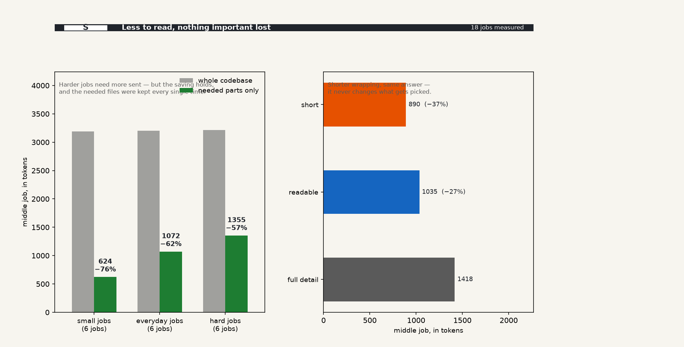
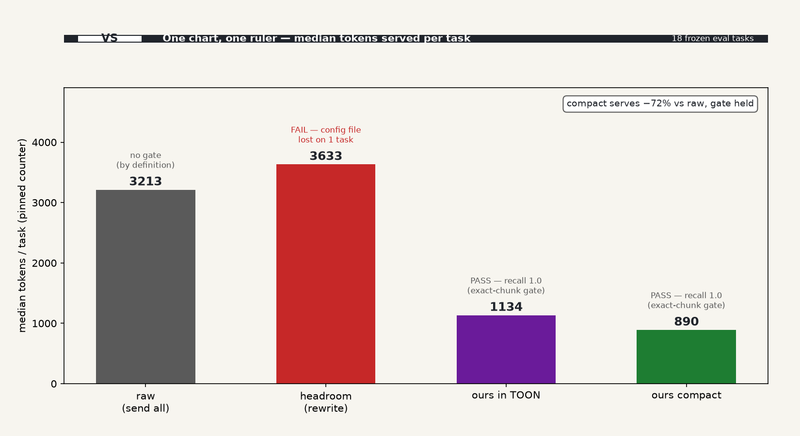
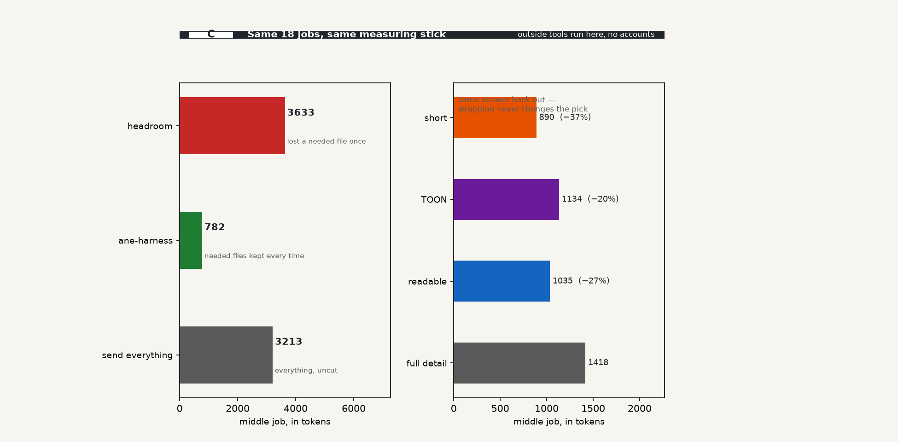
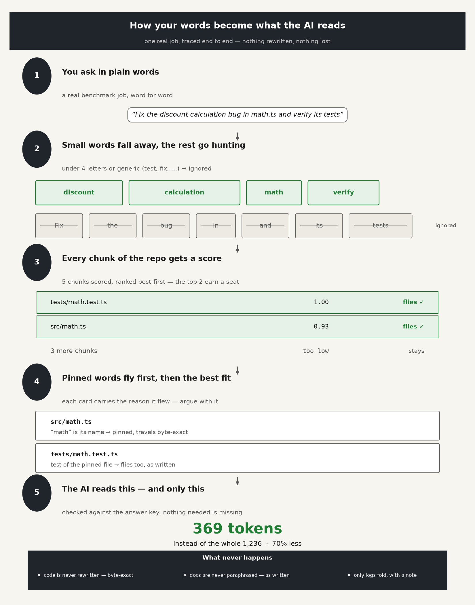

# ⚡ ane-context-harness

[Tiếng Anh](README.md) · [Tiếng Việt](README.vi.md) · [Tiếng Trung](README.zh.md) · [Tiếng Pháp](README.fr.md) · [Tiếng Tây Ban Nha](README.es.md) · [Tiếng Nhật](README.ja.md) · [Tiếng Hàn](README.ko.md)

> **Cắt hơn 60% ngữ cảnh mà agent đọc, giữ mọi dòng bắt buộc, và chọn ngữ cảnh dưới 4ms — chạy hoàn toàn offline trên máy local của bạn.**

[](https://python.org)
[%20%7C%20Linux-brightgreen.svg)]()
[]()
[]()

---

## Đây là gì?

Khi bạn vibe-code hoặc chạy AI agent (Cursor, Claude Code, OpenCode, Cline, Windsurf, Aider), nhồi cả codebase vào cửa sổ ngữ cảnh LLM là **chậm, lãng phí, và nguy hiểm**:
- **Ngữ cảnh phình to:** Nhét cả file vào mọi lượt trò chuyện chôn model dưới boilerplate không liên quan — và nhà cung cấp đếm mọi token, dù có tái sử dụng hay không.
- **Phản hồi chậm hơn:** Thời gian ra token đầu của LLM bò chậm khi prefilling hàng nghìn dòng không cần thiết.
- **Lạc giữa đống ngữ cảnh:** Model ảo giác hoặc bỏ sót bug khi bị chôn dưới boilerplate không liên quan.
- **Rò rỉ secret:** Vô tình gửi secret trong `.env` hoặc AWS credentials tới nhà cung cấp model bên thứ ba.

**ane-context-harness** là một context engine nhẹ, local-first, nằm giữa codebase và coding agent của bạn. Trong **~3 milliseconds**, nó index repo, trích xuất phân cấp symbol (hàm, interface, type), loại nhiễu, redact secret, và đóng gói chỉ evidence code giá trị cao mà agent thực sự cần để hoàn thành task.

> Tên `ane` mang tính lịch sử; nó **không** phải một dependency. Đường đi được ship là thuần CPU và chạy trên macOS Apple Silicon, macOS Intel, và Linux. Tăng tốc phần cứng nằm trong một bản phân phối private riêng.

Không có gọi mạng bên ngoài. 100% riêng tư và offline.

---

## Kết quả benchmark thực tế

Đánh giá trên **30 benchmark tasks** (10 nhỏ, 10 điển hình, 10 khó) trên các codebase Python và TypeScript tổng hợp, theo split đánh giá đóng băng của chúng tôi (`benchmarks/splits.json`):

| Metric | Without Harness (Full Repo Dump) | With Harness (Deterministic) | Ý nghĩa với bạn |
|---|---|---|---|
| **Median Context Tokens** | **3,213 tokens** | **782 tokens** | **Gửi ít hơn 60.47% tới LLM** |
| **Required-Evidence Recall** | 1.0 (100%) | **1.0 (100%)** | **Không bao giờ bỏ sót một mảnh code quan trọng nào** |
| **Context Selection Speed** | ~0.01 ms (raw dump) | **3.05 ms – 3.83 ms** | **Phản hồi local dưới 4ms — nhanh hơn mạng 100x** |
| **Peak Token Savings** | 0% | **Up to 90.32%** | **Tiết kiệm tới ~90% trên các task config & settings có mục tiêu** |
| **Ranking Accuracy (nDCG@10)**| n/a | **0.849** | **Đặt các hàm quan trọng nhất ngay trên cùng** |
| **Secret Redaction** | 0% (leaks all secrets) | **100% local redaction** | **`.env`, AWS keys, và certificates không bao giờ rời máy bạn** |
| **Derived Cost per Task** *(at $3/M)* | ~$0.0096 / task | **~$0.0023 / task** | **Gửi ít hơn ~75% mỗi task ở mức giá đã nêu — hóa đơn thực tế phụ thuộc vào việc nhà cung cấp tái sử dụng thay vì đọc lại** |

*(Latency và memory đo local trên Apple Silicon / CPU; các số cost và TTFT được suy ra theo mức giá token đã nêu; phương pháp và log tái lập được nằm trong `benchmarks/reports/` và `benchmarks/logs/`).*

### Phân tích các task mẫu

| Task Type | Example Task | Raw Tokens | Harness Tokens | Reduction | Recall | Select Latency |
|---|---|---|---|---|---|---|
| **Settings & Config** | `hard-settings-001` | 3,213 | **311** | **90.32%** | **100%** | 3.88 ms |
| **Rules & Logic** | `hard-rules-vs-readme-001` | 3,213 | **445** | **86.15%** | **100%** | 4.22 ms |
| **Bug Fixes (Python)** | `py-discount-report-001` | 3,189 | **629** | **80.28%** | **100%** | 3.72 ms |
| **TypeScript Architecture**| `ts-discount-001` | 1,236 | **369** | **70.15%** | **100%** | 1.84 ms |
| **Complex Multi-file Cart** | `hard-cart-apply-001` | 3,213 | **2,146** | **33.21%** | **100%** | 4.38 ms |

### Tiết kiệm token, đã đo (current main)

Cách đọc biểu đồ này: mỗi job hỏi tool "AI nên đọc gì cho task này?". Panel trái so sánh, theo kích thước job, lượng text bạn sẽ gửi nếu gửi cả codebase (xám) versus những gì harness chọn (xanh) — số phía trên mỗi thanh xanh là lượng bạn gửi bây giờ và nhỏ hơn bao nhiêu. Job khó hơn cần nhiều file hơn, nên thanh xanh lớn hơn — nhưng các file cần thiết được giữ **mọi lần**, đó chính là điểm mấu chốt: nhỏ hơn chỉ tốt nếu không thiếu thứ quan trọng. Panel phải cho thấy cùng một lựa chọn được gửi theo ba cách — đầy đủ chi tiết, mức giữa dễ đọc, và wrapping ngắn nhất — ngắn hơn thì rẻ hơn, và wrapping không bao giờ thay đổi *những gì* được chọn.



Đo bằng `PYTHONPATH=src python3 scripts/measure_token_savings.py`, vẽ bằng `scripts/plot_token_savings.py` (frozen eval split, một bộ đếm token được pin).

### Cùng bài tập đối chiếu với tool thật (không key, không account)

Cách đọc biểu đồ này: đó là một cuộc đua trên cùng 18 jobs với cùng một thước đo — "job giữa giữ bao nhiêu token, và có thứ cần thiết nào bị mất không?". Biểu đồ đầu là headline: gửi hết mọi thứ là mặc định đắt đỏ, tool rewrite bên ngoài thực tế gửi *nhiều hơn* mức cần và từng làm mất một file config mà grader yêu cầu (đánh dấu FAIL), trong khi hai mode của chúng tôi là ngắn nhất và giữ các file cần thiết mọi lần (PASS). Biểu đồ thứ hai cho thấy chi tiết phía sau — riêng việc chọn lọc tiết kiệm được gì, và cùng một lựa chọn co lại lần nữa chỉ bằng cách chọn wrapping ngắn hơn. PASS/FAIL ở đây có đúng một nghĩa: các mảnh mà benchmark grader nói là bắt buộc đã xuất hiện trong pack.





Tái lập: `pip install headroom-ai toon-format`, rồi `PYTHONPATH=src python3 scripts/bench_same_exercise.py`, vẽ bằng `scripts/plot_same_exercise.py`. Task-blind rewriting gửi nhiều hơn so với chọn lọc và không có cổng sống sót; encoder TOON thật fallback sang per-row mappings trên code nhiều dòng trong khi compact của chúng tôi giữ CSV headers với các hàng nguyên văn.

### Tiết kiệm hội thoại, đã đo

Cách đọc: một job không bao giờ là một câu hỏi — agent hỏi, rồi follow-up, rồi verify. Bench này phát lại cùng cuộc hội thoại 3-turn mỗi job theo ba cách: gửi cả codebase mỗi turn (149,490 tokens), một pack đã cắt (17,094), và ba pack được mang theo trong đó mỗi follow-up giữ mọi thứ các turn trước đã tìm thấy (51,940). Hội thoại mang theo gửi **khoảng một phần ba** chi phí không-harness — ít hơn 97,550 tokens, ít hơn 65.3% — và các file cần thiết sống sót cả 72 turns (recall 1.0 mọi turn; một turn làm mất file cần thiết sẽ làm trật cuộc hội thoại, nên cổng đó mang tính chịu tải, không phải trang trí).

Tái lập: `PYTHONPATH=src python3 scripts/bench_conversation.py` (frozen eval split, một bộ đếm token được pin; ghi `benchmarks/reports/conversation-bench-eval.json`). Ranh giới, nói thẳng: không model nào đọc các pack này, follow-up là chuỗi cố định chứ không phải phản ứng agent thật, không gì bị tính phí, không job nào thực sự được hoàn thành. Nó đo nửa chúng ta đưa vào — việc chọn và mang theo — không phải bản thân vòng lặp.

### Điều gì xảy ra với từng file

Bốn quy tắc đã được tài liệu hóa, không model tham gia, không ngoại lệ: file bạn pin (hoặc grader yêu cầu) đi **đúng từng byte, luôn luôn**. Code, config, và diffs giữ cấu trúc — picker chọn cả symbol, không bao giờ viết lại chúng. Chỉ **logs và output tool nhiễu** bị thu gọn (các dòng tiến trình lặp, traceback trùng, spam cài đặt gập thành một dòng tóm tắt nói những gì đã bị loại). Prose đi như đã chọn, không bao giờ diễn lại — không có neural rewriter, nên không gì có thể paraphrase docs của bạn thành điều chúng không nói. Mọi pack liệt kê, theo từng file, quy tắc nào được áp dụng — kiểm tra `diagnostics.routing` trong bất kỳ report nào và tranh luận với nó.

---

## Vì sao developer & vibecoder yêu thích

- 💰 **Ít ngữ cảnh hơn mỗi task, output ổn định:** Bỏ qua file không liên quan tới prompt — và output ổn định giúp nhà cung cấp tái sử dụng những gì đã đọc thay vì tính phí lại. Cut% đo giảm ngữ cảnh local, không bao giờ là hóa đơn của bạn.
- ⚡ **Latency tức thì (~3ms):** Chạy hoàn toàn bằng Python native và C extensions local trên máy Mac hoặc Linux của bạn.
- 🎯 **Độ chính xác điểm đúng chỗ:** Kết hợp khai báo symbol AST (class, TypeScript interface, enum, hàm) với tìm kiếm từ vựng BM25 và packing theo điểm, theo ngân sách token.
- 🛡️ **Khử trùng secret zero-leak:** Tự động quét và redact AWS keys, private RSA/PEM keys, file `.env`, và secret entropy cao bằng placeholder ổn định theo request trước khi render prompt.
- 🔌 **Hỗ trợ agent phổ quát:** Ship sẵn adapter dùng được cho **Anthropic Messages** (với breakpoint prompt-caching), **OpenAI Responses**, chat **OpenAI-Compatible**, và **Markdown** sạch.

---

## Cách hoạt động



Poster một trang được tạo từ pipeline thật (`scripts/plot_packing_overview.py`): từ của task được viết lại thành term có điểm, pin bắt buộc luôn bay, thẻ tùy ý được pack theo điểm trong ngân sách, mọi thẻ được giữ mang theo lý do bạn có thể tranh luận. Phần trăm nói chúng ta gửi ít hơn bao nhiêu so với mọi thứ có thể gửi — hóa đơn thực tế phụ thuộc vào việc nhà cung cấp tái sử dụng thay vì đọc lại.

---

## Bắt đầu nhanh (60 Seconds)

### 1. Cài đặt

Yêu cầu Python 3.13 hoặc 3.14 trên macOS hoặc Linux:

```bash
git clone https://github.com/ericlam2k/ane-context-harness.git
cd ane-context-harness
pip install -e .[test]
```

Xác minh cài đặt của bạn:
```bash
ane-harness health
```

### 1b. Setup một lệnh + prove-it (cổng adoption)

```bash
# index, install the agent skill, smoke-test (prints one summary line)
ane-harness setup --repo /path/to/your/project --repo-id my-project --yes

# prove-it: reduction/latency proof on YOUR repo (5 canned tasks, no labels needed)
ane-harness prove --repo /path/to/your/project --repo-id my-project
# with your own tasks: --tasks-file prompts.jsonl
# with a report dir: --out /tmp/prove-report
```

`prove` không gắn nhãn: nó báo cáo median reduction + p50 latency và
`recall: not_applicable`. Proof recall cần task được gán nhãn thủ công (cơ chế
frozen `benchmarks/splits.json`); các lần chạy không gắn nhãn không bao giờ tuyên bố
recall.

### 2. Index codebase của bạn

Index bất kỳ thư mục hoặc repository local nào vào store SQLite local (incremental và cực nhanh):

```bash
ane-harness index --repo /path/to/your/project --repo-id my-project
```

### 3. Chọn ngữ cảnh liên quan cho một prompt

Lấy một gói Markdown gọn, theo ngân sách token, được may cho coding task của bạn:

```bash
ane-harness select \
  --repo-id my-project \
  --task "Fix the discount calculation bug in checkout" \
  --budget 1200
```

  ### 3b. Ghi log cắt ngữ cảnh trước/sau trên nhiều prompt (`update`)

Chạy selection trên một batch task (file JSONL hoặc stdin) rồi in + log
ngân sách token trước/sau. Local, không mạng:

```bash
# from a JSONL file (one {"task": "..."} or bare task per line)
ane-harness update \
  --repo-id my-project \
  --budget 2000 \
  --tasks-file prompts.jsonl \
  --log benchmarks/logs/update_session.jsonl
```

Output mẫu:

```
repo_id: my-project | tasks: 3 | budget: 2000

  task                              before  after   removed  reduction
  Fix the discount calculation      3189    1952    1237     38.79%
  debug the inventory loader        3189    1758    1431     44.87%
  review reporting stats output     3189    1261    1928     60.46%

  TOTAL: before 9567 → after 4971 tokens (4596 removed, median reduction 44.87%)
```

Các hàng theo task cũng được append dạng JSONL vào `--log` (gitignored).
**Lưu ý trung thực** được in ra stderr mỗi lần chạy: *"local measurements over the
given repo; redaction does not guarantee all secrets are caught."*

Mọi lần chạy cũng in một dòng footer cắt một dòng ra stderr (và cùng
dòng đó làm key `summary` trong stdout JSON), ví dụ
`ane-harness: sent 7.1k instead of 211.2k · cut 96.6% in 165 ms`. Chỉ lời thường —
không jargon, không markup heading `#`. Tổng cộng dồn local (chỉ đếm, không
có text task) — xem chúng
bất cứ lúc nào bằng `ane-harness daily`, hoặc mỗi khi thoát shell với
`eval "$(ane-harness shell-init)"` trong `.zshrc`/`.bashrc` của bạn.

Agent có cùng hành vi không phụ thuộc qua skill đi kèm:
`skills/ane-harness/SKILL.md` — copy vào thư mục skills của agent
và tổng cắt hiện tự động sau mỗi task, không cần setup khác. Với
host tương thích OpenCode/Claude/agent nó cũng chạy global, không cần cài per-project:
`~/.config/opencode/skills/`, `~/.claude/skills/`, hoặc
`~/.agents/skills/` (session mới sẽ nhận).

### 3c. Chế độ proxy cho agent không có tích hợp native (`proxy`)

Pipe task vào stdin (một `{"task": "..."}` hoặc task trần mỗi dòng),
nhận evidence Markdown ra stdout — không cần skill, MCP, hay HTTP:

```bash
printf '%s\n' '{"task": "Fix the discount bug"}' 'review inventory loader' \
  | ane-harness proxy --repo /path/to/your/project --repo-id my-project --budget 2000 \
  > context.md
```

Stdout là Markdown thuần (một doc mỗi task, phân tách bằng `---`, với
ranh giới `<!-- ane-harness task N/M ... -->`); footer cắt
theo task đi ra stderr. Bỏ `--repo` khi repo-id đã được index.

### 4. Hoặc chạy như local background server

> **Agents: do NOT run this inside an agent turn.** `serve` (like `mcp`)
> never exits — a tool call that launches it blocks forever, so the turn
> never completes and every later prompt queues behind it. Bare
> `update`/`proxy` with no `--tasks-file` on an interactive terminal exit
> 2 with a hint instead of waiting on stdin. Inside agent turns use only
> one-shot commands (`index`, `select`, `prove`, `daily`, `health`). Run
> the server detached from a real terminal
> (`nohup ane-harness serve --port 8765 &`) or not at all.

Khởi động HTTP API local (sẵn sàng móc vào agent hoặc tool của bạn):

```bash
ane-harness serve --port 8765
```

Các endpoint có sẵn:
- `GET  /v1/health` — Trạng thái hệ thống, compute mode, và profiles
- `POST /v1/repositories/index` — Index hoặc cập nhật một repository
- `POST /v1/context/select` — Lấy ngữ cảnh đã tối ưu cho một task
- `POST /v1/context/compress-output` — Nén log test/build dài thành digest lỗi sạch

---

## Dùng trong Python

Bạn cũng có thể dùng harness trực tiếp trong workflow AI agent của mình:

```python
from ane_context_harness.config import build_config
from ane_context_harness.pipeline import Pipeline
from ane_context_harness.schemas import SelectRequest
from ane_context_harness.providers import serialize

# 1. Initialize pipeline
cfg = build_config()
pipeline = Pipeline(cfg)

# 2. Index repository
pipeline.register_repository("/path/to/my-repo", repo_id="my-repo")

# 3. Select budgeted context
request = SelectRequest(
    repository_id="my-repo",
    task="Update loyalty point rounding logic in payment service",
    token_budget=1500,
)
package = pipeline.select_context(request)

# 4. Serialize directly for your favorite LLM provider
anthropic_payload = serialize("anthropic", package)
openai_payload    = serialize("openai", package)
markdown_text     = serialize("markdown", package)

print(f"Packed {package.metrics['selected_tokens']} tokens (cut {package.metrics['tokens_removed']} tokens)")
```

---

## Cách nó hoạt động

```
                        Your Codebase
                             │
                     AST & Symbol Parser
               (Python functions, TS interfaces)
                             │
                      Line-Level Chunker
                             │
                      Local SQLite Store
                             │
User Prompt  ──────►   BM25 Lexical Search
                             │
                   Score-First Budget Packer
                  (Mandatory Retention + MMR)
                             │
                  Local Secret Sanitizer
              (Redacts .env, AWS keys, certs)
                             │
               Provider Adapter (Anthropic/OpenAI)
                             │
                   Tight, Accurate Context
```

1. **Chunking AST nhận biết symbol:** Thay vì tách dòng ngây thơ, file được parse theo cấu trúc code thật (class, method, TypeScript type/interface/enum).
2. **Truy xuất xác định:** Truy xuất từ vựng BM25 nhanh, lọc bằng symbol term guards, tách subtoken, và gập số nhiều.
3. **Packing ngân sách theo điểm:** Ngữ cảnh được pack tham lam để vừa khít trong token budget bạn chỉ định (ví dụ 1,200 tokens), bảo đảm evidence bắt buộc không bao giờ bị cắt cụt.
4. **Phát hiện secret & hàng rào riêng tư:** Các pattern loại trừ chuẩn (`.env*`, `.aws/**`, `*.pem`, v.v.) không bao giờ được đọc, và bộ phân loại regex + entropy thay token nhạy cảm bằng placeholder ổn định.
5. **Nén nhiễu:** Output tool dài (test traces, terminal logs) được thu thành digest gọn, vẫn giữ tín hiệu.

### Tăng tốc phần cứng: bản phân phối private riêng

Tên có chứa `ane`, nhưng **không yêu cầu hay tuyên bố silicon chuyên dụng** để
chạy harness. Engine được ship là CPU xác định thuần (Python +
SQLite) và chạy giống nhau trên macOS Apple Silicon, macOS Intel, và Linux.
Tăng tốc neural-hardware được duy trì riêng và không thuộc
repository này.

---

## Thông số kỹ thuật & độ nghiêm ngặt

Dành cho researcher, architect, và technical lead quan tâm tới độ nghiêm ngặt số:

- **Frozen Benchmark Split:** Mọi số phát hành chạy trên frozen 18-task evaluation split (`benchmarks/splits.json`, seed `20261002`). Tuning bị cách ly nghiêm ngặt sang dev split.
- **Bộ ước lượng token xác định:** Đếm token dùng estimator được pin (`TOKEN_ESTIMATOR_VERSION="2"`) nên số liệu tái lập 100% giữa các máy và phiên bản Python mà không bị trôi tokenizer bên ngoài.
- **Chính sách embedding:** Embedding cố ý bị loại ở v0.1 dựa trên đánh đổi cost/latency local. Xem [ADR-002](docs/adr-002-embedding-go-no-go.md).
- **Gói evidence phát hành:** Evidence phát hành có checksum được xác minh mật mã qua `ane-harness evidence verify ane-context-harness-evidence-v0.1`.

---

## Chạy bộ test

```bash
# Run all 258 unit, integration, and security tests
python3 -m pytest -q

# Run concurrent A/B benchmark evaluation
python3 scripts/run_concurrent_ab.py 1 /tmp/eval-run
```

---

## Giấy phép

MIT License. Thiết kế cho trí tuệ local, quyền riêng tư của developer, và ngân sách token hợp lý.