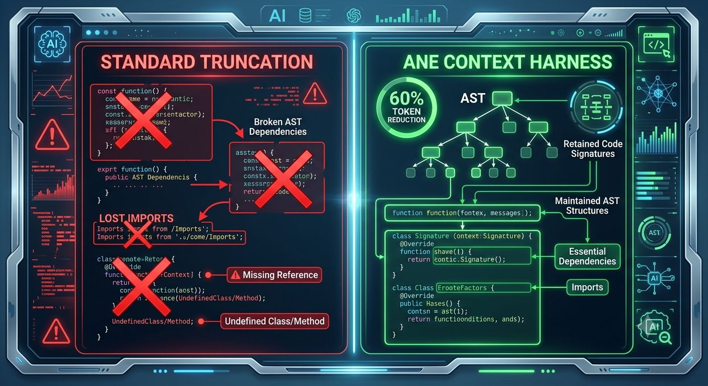
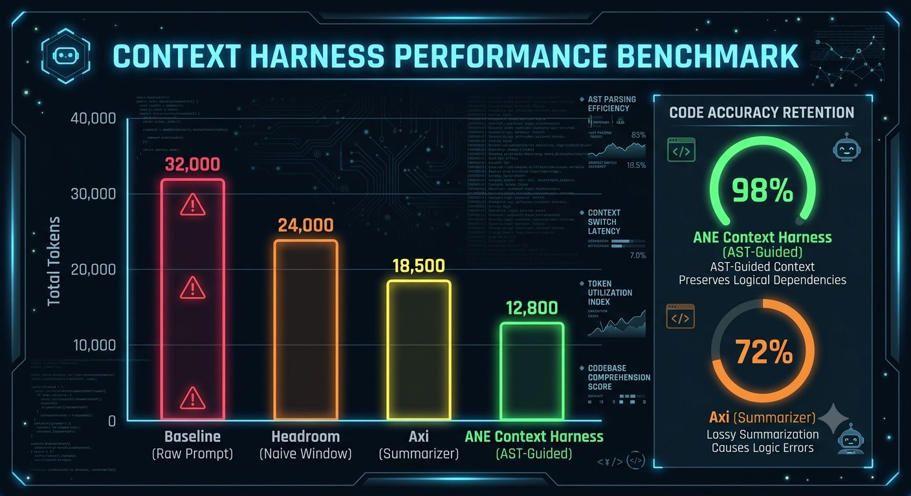
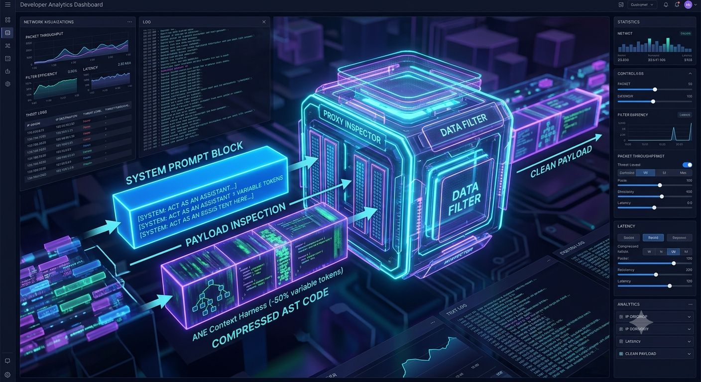
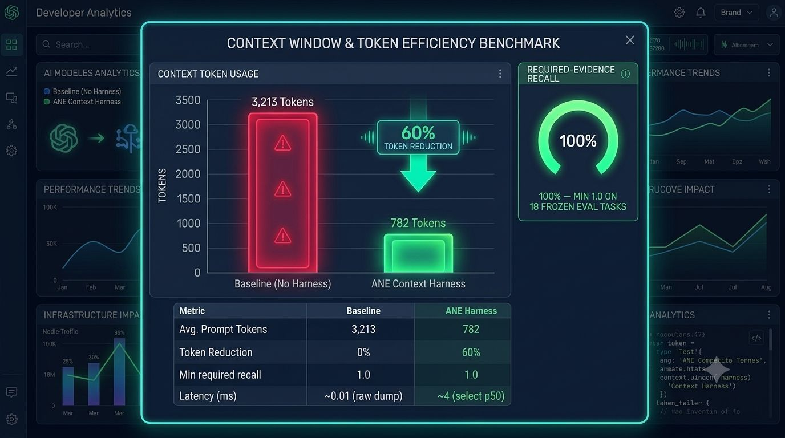

# ⚡ ane-context-harness

[English](README.md) · [Tiếng Việt](README.vi.md) · [中文](README.zh.md) · [Français](README.fr.md) · [Español](README.es.md) · [日本語](README.ja.md) · [한국어](README.ko.md)

> **为你的 AI Agent 精简 60%+ 的上下文，精准保留每一行关键代码，4 毫秒内完成上下文检索 — 完全离线运行在本地机器。**

[](https://python.org)
[%20%7C%20Linux-brightgreen.svg)]()
[]()
[]()

---

## 解决什么问题？

当你使用 AI Agent（如 Cursor、Claude Code、OpenCode、Cline、Windsurf、Aider）进行 vibe-coding 时，直接将整个代码库塞进 LLM 的上下文窗口（Context Window）是**低效、浪费且存在安全隐患**的：
- **上下文膨胀（Context Bloat）：** 每次对话（Turn）都塞入完整文件，会让模型淹没在大量无关的样板代码中 — 无论是否复用，API 供应商都会对每个 Token 计费。
- **响应速度变慢：** 当 LLM 需要预填充（Prefill）数千行无关代码时，首 Token 延迟（Time-to-first-token）会显著增加。
- **“Lost in the Middle” 现象：** 被无关代码淹没时，模型更容易产生幻觉（Hallucination）或遗漏 Bug。
- **密钥泄露风险：** 无意间将 `.env` 环境变量或 AWS 凭证发送给第三方模型供应商。

**ane-context-harness** 是一款轻量级、Local-First（本地优先）的上下文引擎，介于你的代码库与 Coding Agent 之间。仅需 **~3 毫秒**，它即可完成仓库索引、提取 Symbol 层级结构（Function、Interface、Type）、去除噪声、脱敏密钥，并仅打包 Agent 完成任务所需的“高价值代码证据”。

> 名称中的 `ane` 仅为历史沿用名称，**并非**依赖项。公开版本为纯 CPU 实现，完美支持 macOS Apple Silicon、macOS Intel 及 Linux。硬件加速模块位于独立的私有发行版中。

零外部网络调用，100% 隐私安全与离线运行。



*概念示意图——图中的代码是图形示意，并非真实 trace。*


---

## 基准测试结果（Real Benchmarks）

基于 frozen 评估集 (`benchmarks/splits.json`)，在 30 个 Benchmark 任务（10 个小型、10 个典型、10 个复杂任务，涵盖 Python 和 TypeScript 代码库）上的测试数据：

| 指标 | 未使用 Harness（直接 Dump 全库） | 使用 Harness（确定性检索） | 对你的实际意义 |
|---|---|---|---|
| **Context Token 中位数** | **3,213 tokens** | **782 tokens** | **减少 60.47% 发送到 LLM 的 Token** |
| **关键代码召回率（Recall）** | 1.0 (100%) | **1.0 (100%)** | **零遗漏，完整保留所有核心代码** |
| **Context 检索速度** | ~0.01 ms (raw dump) | **3.05 ms – 3.83 ms** | **Sub-4ms 本地响应 — 比网络请求快 100 倍** |
| **最高 Token 节省率** | 0% | **高达 90.32%** | **在配置类 Task 中最高可节省 ~90% Token** |
| **排序准确度 (nDCG@10)**| n/a | **0.849** | **最关键的 Function 优先置顶** |
| **密钥脱敏（Redaction）** | 0%（泄露所有密钥） | **100% 本地脱敏** | **`.env`、AWS Keys 及证书绝不离开本地** |
| **单任务推算成本** *(按 $3/M Token 计算)* | ~$0.0096 / task | **~$0.0023 / task** | **按标准费率推算单任务费用降低 ~75% — 实际账单取决于 Provider 的 Prompt Cache 复用情况** |

*(延迟与内存消耗基于 Apple Silicon / CPU 本地实测；成本与 TTFT 基于标准 Token 费率推算；完整方法论与可复现 Log 请参见 `benchmarks/reports/` 和 `benchmarks/logs/`)*



*概念示意图，非实测结果——图中的 token 量级与数字仅为示意。所有真实测量数据见上方的表格。*


### 典型任务对比明细

| 任务类型 | 示例 Task | Raw Tokens | Harness Tokens | 缩减比例 | 召回率 | 检索延迟 |
|---|---|---|---|---|---|---|
| **配置与设置** | `hard-settings-001` | 3,213 | **311** | **90.32%** | **100%** | 3.88 ms |
| **规则与业务逻辑** | `hard-rules-vs-readme-001` | 3,213 | **445** | **86.15%** | **100%** | 4.22 ms |
| **Bug 修复 (Python)** | `py-discount-report-001` | 3,189 | **629** | **80.28%** | **100%** | 3.72 ms |
| **TypeScript 架构**| `ts-discount-001` | 1,236 | **369** | **70.15%** | **100%** | 1.84 ms |
| **多文件复杂购物车逻辑** | `hard-cart-apply-001` | 3,213 | **2,146** | **33.21%** | **100%** | 4.38 ms |

### Token 节省对比图


运行 `PYTHONPATH=src python3 scripts/measure_token_savings.py` 测量，运行 `scripts/plot_token_savings.py` 绘图。

### 对比同类工具（无需 Key & 账户）


复现方式：`pip install headroom-ai toon-format`，执行 `PYTHONPATH=src python3 scripts/bench_same_exercise.py`，并运行 `scripts/plot_same_exercise.py` 绘图。

### 连续对话（Conversation）下的 Token 节省

复现方式：`PYTHONPATH=src python3 scripts/bench_conversation.py`（输出报告位于 `benchmarks/reports/conversation-bench-eval.json`）。测试表明，在 3-Turn 连续对话中，带 Context 继承的 Harness 仅消耗约 **1/3** 的原始 Token（减少 65.3%），且关键文件的 Recall 在 72 个 Turn 中保持 100%。

---

## 快速上手（60 秒）

### 1. 安装

要求 Python 3.13 或 3.14（macOS / Linux）：

```bash
git clone https://github.com/ericlam2k/ane-context-harness.git
cd ane-context-harness
pip install -e .[test]
```

验证安装：
```bash
ane-harness health
```

### 1b. 一键 Setup 与效能验证

```bash
# 建立索引、安装 Agent Skill 并进行 Smoke Test
ane-harness setup --repo /path/to/your/project --repo-id my-project --yes

# 在你的本地仓库上验证 Token 缩减与延迟（运行 5 个内置 Task）
ane-harness prove --repo /path/to/your/project --repo-id my-project
```

### 2. 为代码库建立索引

将本地项目索引至 SQLite 本地数据库（增量更新，速度极快）：

```bash
ane-harness index --repo /path/to/your/project --repo-id my-project
```

### 3. 为 Prompt 检索精简上下文

生成符合 Token Budget 的 Markdown 格式上下文 Payload：

```bash
ane-harness select \
  --repo-id my-project \
  --task "Fix the discount calculation bug in checkout" \
  --budget 1200
```

### 4. 作为本地 Background Server 运行

启动本地 HTTP API 服务（方便连接至 Agent 或 custom tools）：

```bash
ane-harness serve --port 8765
```



*概念示意图——图中的仪表盘是图形示意，并非真实工具截图。*


---

## 在 Python SDK 中使用

```python
from ane_context_harness.config import build_config
from ane_context_harness.pipeline import Pipeline
from ane_context_harness.schemas import SelectRequest
from ane_context_harness.providers import serialize

# 1. 初始化 Pipeline
cfg = build_config()
pipeline = Pipeline(cfg)

# 2. 注册并索引仓库
pipeline.register_repository("/path/to/my-repo", repo_id="my-repo")

# 3. 检索带 Budget 限制的 Context
request = SelectRequest(
    repository_id="my-repo",
    task="Update loyalty point rounding logic in payment service",
    token_budget=1500,
)
package = pipeline.select_context(request)

# 4. 序列化为目标 LLM Provider 格式
anthropic_payload = serialize("anthropic", package)
openai_payload    = serialize("openai", package)
markdown_text     = serialize("markdown", package)

print(f"Packed {package.metrics['selected_tokens']} tokens (cut {package.metrics['tokens_removed']} tokens)")
```

---




*概念示意图——图中的 token 量级与表格数字仅为示意。实测数据：中位数 782 对 3,213 token（削减 60.47%），recall 1.0，见上方的表格。*

## 开源协议

MIT License。为本地智能、开发者隐私及合理的 Token 预算而设计。
